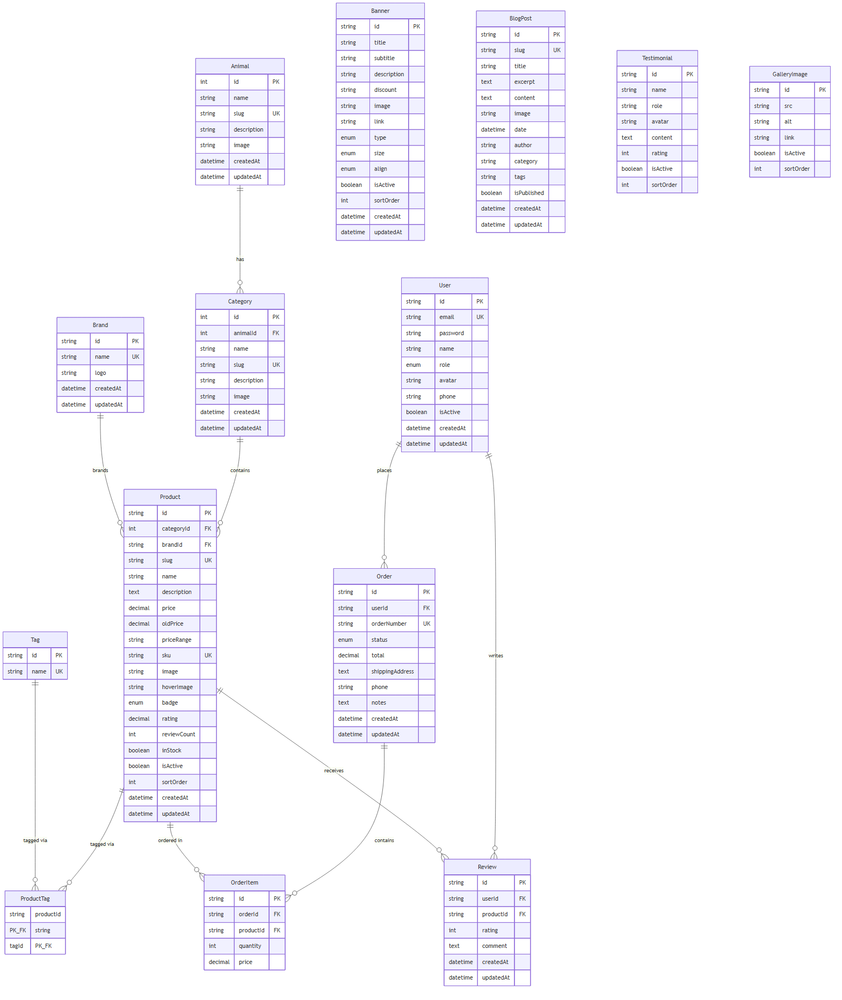
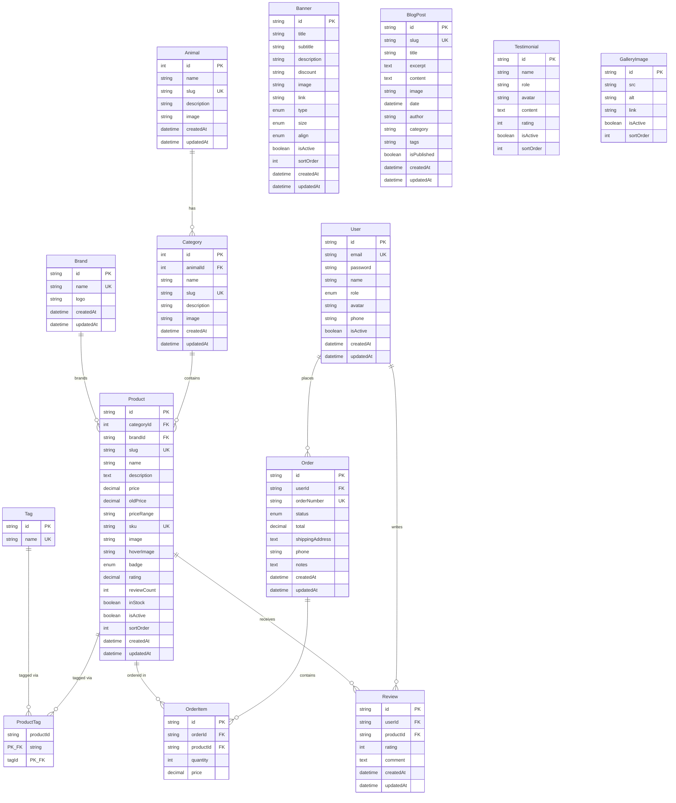

# Petmania Database ERD

Entity-relationship diagram for the PostgreSQL schema defined in [`prisma/schema.prisma`](./prisma/schema.prisma).

## Diagram



<details>
<summary>Mermaid source</summary>



</details>

### Regenerate image

Source: [`database-erd.mmd`](./database-erd.mmd)

```bash
npx @mermaid-js/mermaid-cli -i database-erd.mmd -o database-erd.png -b white -s 2
```

## Relationship Summary

| From | To | Cardinality | Notes |
|------|----|-------------|-------|
| **Animal** | **Category** | 1 → many | `animalId` FK, cascade delete |
| **Category** | **Product** | 1 → many | `categoryId` FK (required) |
| **Brand** | **Product** | 1 → many | `brandId` FK (optional) |
| **Product** ↔ **Tag** | via **ProductTag** | many ↔ many | composite PK `(productId, tagId)` |
| **User** | **Order** | 1 → many | |
| **Order** | **OrderItem** | 1 → many | cascade delete on order |
| **Product** | **OrderItem** | 1 → many | |
| **User** | **Review** | 1 → many | unique `(userId, productId)` |
| **Product** | **Review** | 1 → many | cascade delete on product |

## Standalone Tables

These tables have no foreign-key relations to other entities:

| Table | Purpose |
|-------|---------|
| **Banner** | Hero sliders and promo banners |
| **BlogPost** | Blog articles (`category` and `tags` are plain strings, not FKs) |
| **Testimonial** | Customer testimonials |
| **GalleryImage** | Gallery / Instagram-style images |

## Enums

| Enum | Values |
|------|--------|
| `ProductBadge` | `SALE`, `NEW`, `HOT`, `SOLD_OUT` |
| `BannerType` | `HERO`, `PROMO` |
| `BannerSize` | `SMALL`, `MEDIUM`, `LARGE` |
| `BannerAlign` | `LEFT`, `RIGHT`, `CENTER` |
| `OrderStatus` | `PENDING`, `PROCESSING`, `SHIPPED`, `DELIVERED`, `CANCELLED` |
| `UserRole` | `ADMIN`, `USER` |

## Taxonomy Hierarchy

```
Animal (Cat, Dog, Bird, Fish)
  └── Category (Cat Food, Dog Toys, …)
        └── Product
              ├── Brand (optional)
              ├── Tags (many-to-many)
              ├── Reviews
              └── OrderItems
```

## Table Name Mapping

Prisma models map to PostgreSQL tables via `@@map`:

| Model | Table |
|-------|-------|
| `Animal` | `animals` |
| `Category` | `categories` |
| `Brand` | `brands` |
| `Tag` | `tags` |
| `Product` | `products` |
| `ProductTag` | `product_tags` |
| `Banner` | `banners` |
| `BlogPost` | `blog_posts` |
| `Testimonial` | `testimonials` |
| `GalleryImage` | `gallery_images` |
| `User` | `users` |
| `Order` | `orders` |
| `OrderItem` | `order_items` |
| `Review` | `reviews` |
